# American put option pricing as a parabolic free boundary problem 

The goal of this project is to formulate the American put option pricing problem mathematically as a parabolic free boundary problem, solve the problem numerically and study a selection of regularity properties of the extracted free boundary and numerical solution. 

More precisely, we first construct a numerical solution to the Black-Scholes equation in the case of a European put option using a fully implicit finite difference scheme, and validate this approximate solution against the closed-form solution available. We then incorporate the obstacle imposed in the American case and re-solve the problem numerically using projective successive over-relaxation (PSOR). In the process we extract the free boundary of our numerical solution, which determines when it is optimal for the holder to exercise the option. We assess the regularity properties of both our free boundary and numerical solution against some regularity properties known to hold for the exact solution, as asserted by Barles et. al. [[1]](#references) and Jaillet et. al. [[2]](#references). In particular, we look at the asymptotic behaviour of the free boundary at maturity and the behaviour of the option's Delta and Gamma across the free boundary. We then study how the free boundary is affected by parameters such as the volatility and interest rate.

I learned most of the background on theory and numerical techniques from Chapters 7-9 of the text [[3]](#references).

## European and American put options

### European case

A European put option gives the holder the right (but not the obligation) to sell an asset at a specified strike price $K$ at a specified maturity time $T$. If $S_t$ denotes the price of the asset at time $t \leq T$, then the payoff at maturity is 

$$(K-S_T)^+.$$

The price of the option at times $t < T$ may be considered as a function of $S$ and $t$ and, under certain assumptions, is given by the solution to the Black-Scholes equation 

$$\frac{\partial V}{\partial t} + \frac{1}{2}\sigma^2 S^2 \frac{\partial^2 V}{\partial S^2} + rS\frac{\partial V}{\partial S} - rV = 0$$

with terminal condition $V(S,T) = (K-S)^+$. Here, $\sigma$ denotes the volatility and $r$ is the risk-free rate. We also have the boundary conditions $\lim_{S\rightarrow \infty} V(S,t) = 0$ (the put option is essentially worthless when the underlying price is far above the strike price) and $V(0,t) = K e^{-r(T-t)}$ (if the stock is worthless then the put option is worth its strike price discounted from maturity back to time $t$). 

Making the substitutions

$$\tau = T - t, \quad u = Se^{r\tau} \quad \text{and}\quad x = \ln\bigg(\frac{S}{K}\bigg) + \bigg(r - \frac{1}{2}\sigma^2\bigg)\tau$$

transforms the Black-Scholes equation into the 1D heat equation

$$\frac{\partial u}{\partial \tau} = \frac{1}{2}\sigma^2 \frac{\partial^2 u}{\partial x^2},$$

which can be solved uniquely and in closed form. Transforming back into the original variables yields the solution

$$V(S,t) = K e^{-rt}N(-d_2) - SN(-d_1),$$

where $N$ is the CDF of the standard normal distribution and 

$$d_1 = \frac{\ln\big(\frac{S}{K}\big) + \big(r + \frac{\sigma^2}{2}\big)t}{\sigma\sqrt{t}}, \quad d_2 = d_1 - \sigma\sqrt{t}.$$

### American case

An American put option gives the holder the additional flexibility to exercise the option at any time before maturity. The first change required in the PDE formulation is the boundary condition at $S=0$: since one no longer has to wait until maturity, an American put option is simply worth its strike price if the stock price hits zero, i.e. $V(0,t) = K$. The second change is more interesting: rather than just the terminal condition $V(S,T) = (K-S)^+$, the option price must also satisfy

$$V(S,t) \geq (K-S)^+$$

at all times $t \leq T$. Indeed, if this weren't the case then there would be an arbitrage opportunity: one could buy the asset at price $S$, purchase the put option at price $V$ and immediately exercise it to sell the asset at price $K$, resulting in a profit of $K - S - V > 0$.

Therefore, the price of an American put option is characterised by the constraint $V(S,t) \geq (K-S)^+$ together with the condition that the Black-Scholes equation is satisfied in the region where $V(S,t) > (K-S)^+$, which we refer to as the *continuation region*. In the *exercise region*, where $V(S,t) = (K-S)^+$, it is optimal for the holder to exercise the option. The interface between these two regions is the so-called free boundary, a curve $S^*(t)$ which determines for each time $t$ the threshold asset price below which exercise is optimal and above which the Black-Scholes equation governs the option price. Mathematically, we are therefore looking to solve the following subject to the initial and boundary conditions stated above:

$$ \min\bigg\{V - (K-S)^+, \,\, \frac{\partial V}{\partial t} + \frac{1}{2}\sigma^2 S^2 \frac{\partial^2 V}{\partial S^2} + rS\frac{\partial V}{\partial S} - rV\bigg\} = 0.$$

By standard theory for linear parabolic free boundary problems, this problem admits a unique weak/viscosity solution, although unlike the European case there is no closed form. 

We would like to study whether our numerical solutions exhibit certain regularity properties known to hold for exact solutions. The first property concerns the free boundary itself, which by classical theory is smooth away from $t= T$ but exhibits more interesting behaviour at expiry: by Barles et. al. [[1]](#references), the free boundary $S^*(t)$ should obey the asymptotics 

$$ K - S^*(t) \sim \sigma K \sqrt{(T-t)|\ln (T-t)|} \quad \text{as }t\rightarrow T.$$

We also investigate the behaviour of our numerical solution *across* the free boundary away from maturity. Again, classical theory tells us that the solution $V$ is smooth in the continuation region away from maturity, but across the free boundary there is a loss of regularity at second order in space and first order in time. More precisely, by Jaillet et. al. [[2]](#references) we expect 

$$ V \in C_{S,\, \text{loc}}^{1,1} C^{0,1}_{t,\,\text{loc}}((0,\infty)\times[0,T)) \quad\text{but}\quad V\not\in C_{S,\, \text{loc}}^2 C^1_{t,\,\text{loc}}((0,\infty)\times[0,T))$$

We point out that whilst continuity of $V$ is clear from the problem definition, differentiability in $S$ across the free boundary must be derived and is known as the *smooth-fit condition*. 
## Numerical analysis 

### European case

We consider the equation obtained by making the substitution $\tau = T - t$ and considering $V$ as a function of $S$ and $\tau$:

$$\frac{\partial V}{\partial \tau} =  \frac{1}{2}\sigma^2 S^2 \frac{\partial^2 V}{\partial S^2} + rS\frac{\partial V}{\partial S} - rV.$$

Note that the terminal condition has now become the initial condition $V(S,0) = (K-S)^+$. The boundary condition at $S=0$ reads $V(0,\tau) = Ke^{-r\tau}$, and to approximate the boundary condition at $S = \infty$, we truncate the $S$ domain to $S\in[0,S_\text{max}]$, where $S_\text{max}$ is some fixed multiple of the strike price at which the option would essentially be worthless in practice (e.g. $S_\text{max}\approx 4K$), and set $V(S_\text{max},\tau) = 0$. The domain for the PDE is therefore just the rectangle $[0, S_\text{max}]\times(0,T]$, which lends itself to the finite difference method. 

We discretise the interval $[0, S_\text{max}]$ into $M+1$ points 

$$S_i = i\Delta S \quad \text{for} \quad i=0,1,\dots,M \quad \text{and} \quad \Delta S = \frac{S_\text{max}}{M}$$

and the interval $[0,T]$ into $N+1$ points 

$$\tau_n = n\Delta \tau \quad \text{for} \quad i=0,1,\dots,N \quad \text{and} \quad \Delta \tau = \frac{T}{N},$$

and define

$$V_i^n = V(S_i, \tau_n).$$

We start with a fully implicit scheme in which the time derivative is approximated at $t_{n+1}$ using a backward difference and the spatial derivatives are approximated at $t_{n+1}$ using central differences. This is in contrast to a computationally cheaper but less stable fully explicit scheme which uses forward differences at time $t_n$ (other numerical schemes with favourable properties are also available, such as the Crank-Nicolson method which uses central differences at time $t_{n+\frac{1}{2}}$). Substituting the approximations

$$\frac{\partial V}{\partial S}(S_i, \tau_{n+1}) \approx \frac{V_{i+1}^{n+1} - V_{i-1}^{n+1}}{2\Delta S} \qquad (i=1,\dots,M-1, \quad n = 0, \dots, N-1),$$

$$\frac{\partial^2 V}{\partial S^2}(S_i, \tau_{n+1}) \approx \frac{V_{i+1}^{n+1} - 2 V_i^{n+1} + V_{i-1}^{n+1}}{(\Delta S)^2} \qquad (i=1,\dots,M-1, \quad n = 0, \dots, N-1),$$

$$ \frac{\partial V}{\partial \tau}(S_i, \tau_{n+1}) \approx \frac{V_i^{n+1} - V_i^n}{\Delta \tau} \qquad (i=0, \dots, M, \quad n = 0, \dots, N-1)$$

into our equation, we obtain for $i = 1,\dots, M-1$ and $n = 0, \dots, N-1$ the equation

$$ V_i^n = a_i V_{i-1}^{n+1} + b_i V_i^{n+1} + c_i V_{i+1}^{n+1} $$

where

$$a_i = -\frac{\Delta \tau}{2}(\sigma^2 i^2 - ri), \quad b_i = 1 + \Delta\tau(\sigma^2 i^2 + r), \quad c_i = -\frac{\Delta\tau}{2}(\sigma^2 i^2 + ri).$$

The initial condition $V(S,0) = (K-S)^+$ implies $V_i^0 = V(S_i, 0) = (K-S_i)^+$ for each $i = 0, \dots, M$, the boundary condition $V(0,\tau) = Ke^{-r\tau}$ implies $V_0^n = V(S_0, \tau_n) = V(0, \tau_n) = Ke^{-r\tau_n}$ for $n = 0, \dots, N$ and the boundary condition $V(S_\text{max},\tau) = 0$ implies $V_M^n = V(S_\text{max},\tau_n) = 0$ for $n=0,\dots,N$. 

Thus for each $n=0,\dots,N-1$ we have the linear system 

$$
\begin{align}
\begin{pmatrix}
b_1 & c_1 & 0 & 0 & \cdots & 0 & 0 & 0 \\
a_2 & b_2 & c_2 & 0 & \cdots & 0 & 0 & 0\\
0 & a_3 & b_3 & c_3 & \cdots & 0& 0 & 0\\
\vdots & \vdots & \vdots & \vdots & \ddots & \vdots & \vdots & \vdots \\
0 & 0 & 0 & 0 & \cdots & a_{M-2}& b_{M-2} & c_{M-2} \\
0 & 0 & 0 & 0 & \cdots & 0 & a_{M-1} & b_{M-1}
\end{pmatrix} 
\begin{pmatrix} V_1^{n+1} \\[4pt]
V_2^{n+1} \\
\vdots \\[4pt]
V_{M-2}^{n+1} \\[4pt]
V_{M-1}^{n+1}
\end{pmatrix} & = \begin{pmatrix} V_1^n - a_1 V_0^{n+1} \\[4pt] 
V_2^{n} \\
\vdots \\[4pt]
V_{M-2}^n \\[4pt]
V_{M-1}^n - c_{M-1}V_M^{n+1} 
\end{pmatrix} \nonumber \\[40pt]
& = \begin{pmatrix} V_1^n - a_1 Ke^{-r\tau_{n+1}} \\[4pt] 
V_2^{n} \\
\vdots \\[4pt]
V_{M-2}^n \\[4pt]
V_{M-1}^n
\end{pmatrix}\nonumber
\end{align}
$$

(which incorporates the two boundary conditions), along with the initial condition 

$$
\begin{pmatrix}
V_1^0 \\[4pt]
V_2^0 \\
\vdots \\[4pt]
V_{M-2}^0 \\[4pt]
V_{M-1}^0 
\end{pmatrix} = \begin{pmatrix}
(K-S_1)^+ \\[4pt]
(K-S_2)^+ \\
\vdots \\[4pt]
(K-S_{M-2})^+ \\[4pt]
(K-S_{M-1})^+ 
\end{pmatrix}. 
$$

Inverting the tridiagonal matrix above (which we henceforth denote by $A$) then allows us to iteratively find the value of $V_i^n$ at any time step $n$. Moreover, this inversion can be carried out somewhat efficiently since $A$ is tridiagonal (in the code we use `scipy.linalg.solve_banded`, which inverts $A$ using Thomas' algorithm). 

### American case

We first observe that arguments above remain valid for American options **in the continuation region**, subject to the following small change: the boundary condition at $S=0$ is now $V(0,\tau) = K$, which implies $V_0^n = K$ for $n = 0, \dots, N$. The effect of this change is that the first entry on the RHS of the above matrix equation becomes $V_1^n - a_1 K$. 

Globally, i.e. also taking into account the exercise region, things are more complicated. Denote 

$$V^{n+1} := (V_1^{n+1}, \dots, V_{M-1}^{n+1})^T, \qquad \widetilde{V}^n = V^n - (a_1 K, 0, \dots, 0)^T \quad \text{and} \quad \phi_i = (K-S_i)^+. $$

 Then at each time step, the solution $V^{n+1}$ must satisfy the following entry-wise:

$$V^{n+1} \geq \phi, \quad AV^{n+1} \geq \widetilde{V}^n  \quad \text{and} \quad (V^{n+1}-\phi)^T(AV^{n+1} - \widetilde{V}^n) = 0,$$

i.e. for each $i = 1, \dots, M-1$ we require 

$$V^{n+1}_i \geq \phi_i, \quad (AV^{n+1})_i \geq \widetilde{V}^n_i  \quad \text{and} \quad (V^{n+1}-\phi)_i(AV^{n+1} - \widetilde{V}^n)_i = 0.$$

To solve this constrained system we use the method of projective successive over-relaxation (PSOR), which uses the Gauss-Seidel iterative procedure at each time step combined with projections (to incorporate the constraint) and over-relaxations (to speed up convergence). Let us first explain the Gauss-Seidel method. Recall the non-matrix form of our discretised equation:

$$ V_i^n = a_i V_{i-1}^{n+1} + b_i V_i^{n+1} + c_i V_{i+1}^{n+1}.$$

Noting that $b_i = 1 + \Delta\tau(\sigma^2 i^2 + r) > 0$, we therefore have the following equation at time step $n+1$: 

$$ V_i^{n+1} = \frac{V_i^n - a_i V_{i-1}^{n+1} - c_i V_{i+1}^{n+1}}{b_i}.$$

The quantity $V_i^n$ is from the previous time step and is therefore known, but the quantities $V_{i-1}^{n+1}$ and $V_{i+1}^{n+1}$ are from the current time step and are not yet known. Starting with an initial guess $V^{n+1, (0)}$ for the vector $V^{n+1} = (V_1^{n+1}, \dots, V_{M-1}^{n+1})$, the Gauss-Seidel method cycles through the components of this vector multiple times and, using a bracketed index $(k)$ to denote the $k$'th run-through, updates $V_i^{n+1, (k)}$ to $V_i^{n+1, (k+1)}$ via the formula:

$$ V_i^{n+1, (k+1)} = \frac{V_i^n - a_i V_{i-1}^{n+1, (k+1)} - c_i V_{i+1}^{n+1, (k)}}{b_i}.$$

Note when one reaches the $i$'th vector component on the $(k+1)$'st iteration through the vector components, everything on the RHS above is already known. Under certain assumptions which we do not discuss here, $V_i^{n+1, (k+1)}$ converges to $V_i^{n+1}$ as $k\rightarrow \infty$. 

In the absence of over-relaxation (which we explain in a moment), the PSOR algorithm simply modifies the Gauss-Seidel method by projecting up onto the constraint if the Gauss-Seidel candidate falls below it. Using hats to denote quantities arising in this new procedure, we therefore have

$$ \hat{V}_i^{n+1, (k+1)} = \max\biggl\{\frac{\hat{V}_i^n - a_i \hat{V}_{i-1}^{n+1, (k+1)} - c_i \hat{V}_{i+1}^{n+1, (k)}}{b_i}, \,\, (K - S_i)^+\biggr\}.$$

Finally, over-relaxation with parameter $\omega \geq 1$ pushes the initial Gauss-Seidel update further in the direction of the change before projecting. More precisely, denoting 

$$ V_{i, \omega}^{n, (k+1)} = V_i^{n+1, (k)} + \omega \big(V_i^{n+1, (k+1)} - V_i^{n+1, (k)}\big),$$

the PSOR update is given by 

$$ \widetilde{V}_i^{n, (k+1)} = \max\bigl\{V_{i,\omega}^{n, (k+1)}, \,\, (K-S_i)^+ \bigr\}.$$

This agrees with the Gauss-Seidel method with projection when $\omega = 1$, and is referred to as `over-relaxed' when $\omega > 1$. We note that although choosing $\omega > 1$ may speed up convergence, choosing $\omega$ too large can cause instabilities and failure to converge. 

## The code and its outputs

### European case

`european_fdm.py` contains three functions: 

1. `european_put_implicit_fdm` uses the fully implicit scheme described above to compute an approximate solution to the Black-Scholes equation in the case of a European put option. It takes as input `S_max, K, T, r sigma, M, N`, all of which have been defined above. 

2. `european_put_closed_form` computes the exact solution to the Black-Scholes equation in the case of a European put option using the closed form solution given above. It takes as input `S, K, T, r, sigma`. 

3. `european_put_closed_form_sampled` takes the same inputs as `european_put_implicit_fdm` and samples the exact solution returned by `european_put_closed_form` on the corresponding grid points. This allows for comparisions between the approximate and exact solutions. 

The following is a plot of both the approximate FDM solution and the sampled exact solution at $t=0$ with $M = N = 500$; as one might hope, these are virtually indistinguishable:

  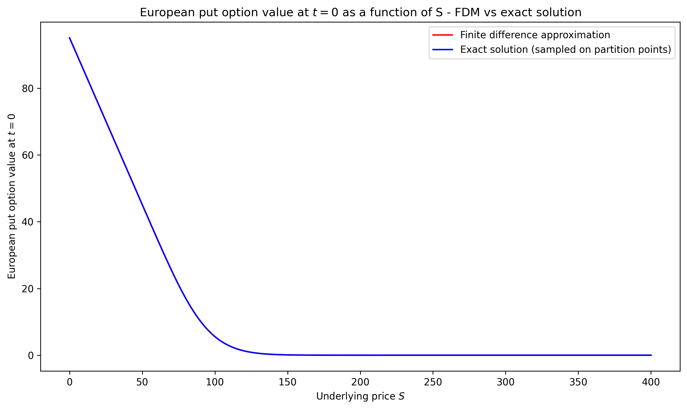

The surface plots for $0 \leq \tau \leq T$ are also essentially indistinguishable: 

  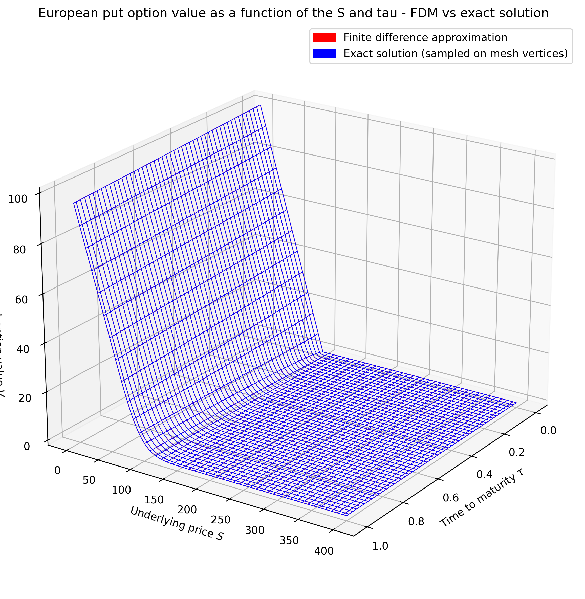

We also plot $\|V_\text{FDM} - V_\text{exact}\|_{L^\infty(\text{mesh})}$ as a function of $1/M$ (with $M = N$):

  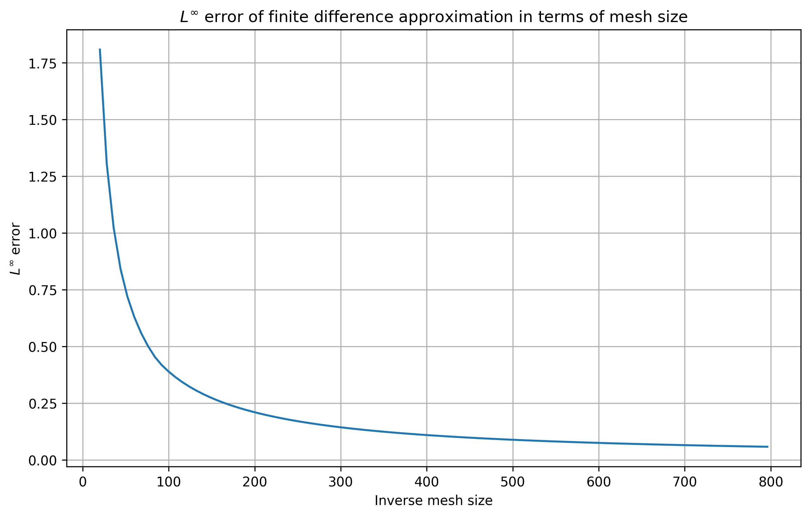

### American case

`american_fdm.py` contains three functions:

1. `american_put_implicit_psor` uses the PSOR scheme explained above to compute an approximate solution to the Black-Scholes equation in the case of an American put option. In addition to the arguments `S_max, K, T, r, sigma, M, N` in the European case, it also contains the arguments `omega, tol, max_iter`. Here, `omega` is the over-relaxtion parameter, `tol` is a small number resembling a threshold for convergence, and `max_iter` determines the maximum number of times we cycle through the solution vector at each time slice in the event our convergence criterion is not met. 

2. `extract_free_boundary` extracts for each time slice the grid value of $S$ below which the holder should exercise. It also returns the corresponding option value $V$, which is used to project the free boundary curve onto the surface of the solution. It takes as input the partition `S_partition` of the $S$-domain, the approximate solution `V`, the strike price `K` and a tolerance `tol` which is used to deal with potential numerical instabilities near the free boundary.

3. `theoretical_asymptotic` restricts to a smaller timeframe near maturity and constructs the theoretical asymptotic value $\sigma K \sqrt{\tau |\ln \tau|}$. 

We first plot our numerical solutions for both the European and American put options at $t=0$: 

  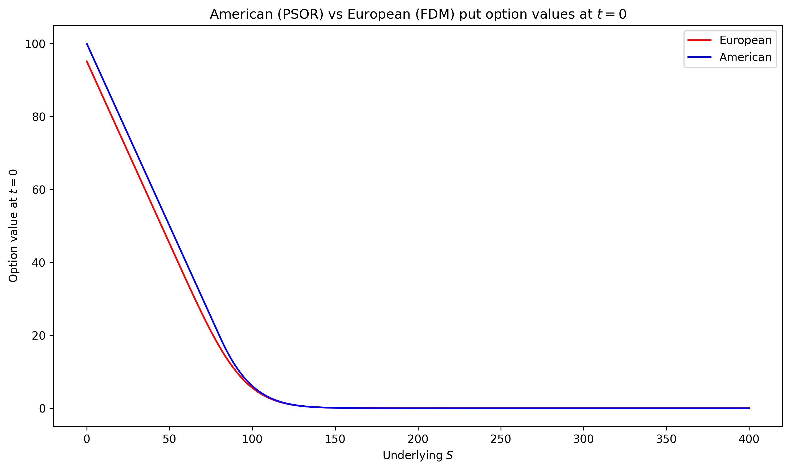

As we know to be the case analytically, the value of the American option lies above that of the European option, and qualitatively these two curves may appear very similar from the picture above. The impact of the free boundary in the American case will become clearer later when we take derivatives, but something interesting can still be seen by plotting the gap between the two curves above:

  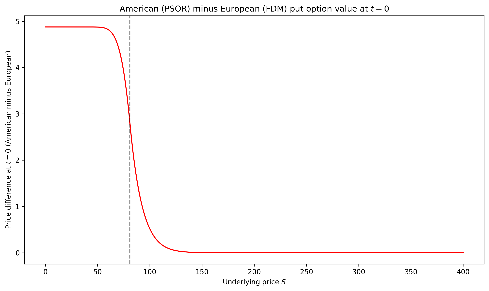

As expected, the gap is close to zero for large $S$ (since both options are essentially worthless in this region). On the other hand, for small values of $S$, the American put is worth $K-S$ (since it is optimal to exercise immediately) whereas the European put is worth roughly $Ke^{-rT} - S$ (since it is very likely to finish in the money). Therefore their difference is worth roughly the constant value $K(1-e^{-rT})$. In between these two extreme regimes for $S$ lies the free boundary threshold value (denoted with the dashed line), and it is around this value that we see the sharpest changes in the gap. 

Before considering surface plots of the American put option and studying Delta and Gamma, we turn to the free boundary curve. We first plot the curve itself extracted from our PSOR scheme:

  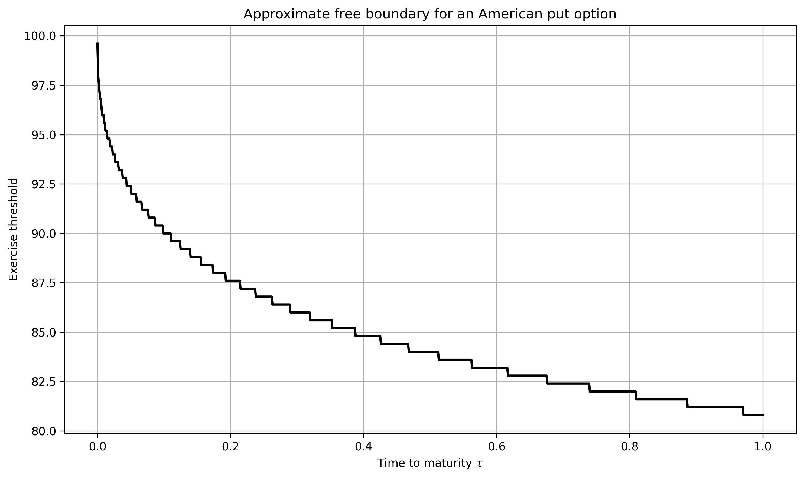

The next plot compares our extracted free boundary curve (more precisely, the strike price minus the free boundary values) in a neighbourhood of $\tau = 0$ with the analytically predicted asymptotic values $\sigma K \sqrt{\tau |\ln \tau|}$. We can see that despite the non-smooth nature of our extracted free boundary, which is inherent to the numerical methods employed, the plot clearly supports the claimed asymptotics:

  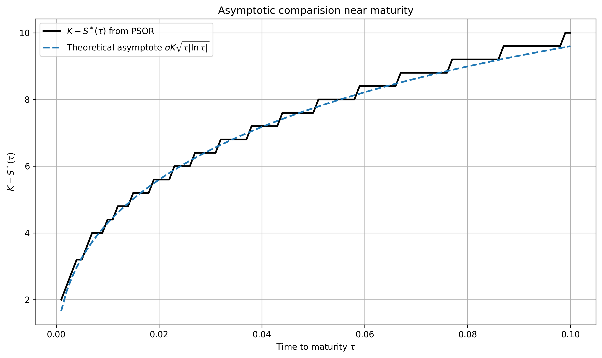

In some of the following plots, we project the free boundary value(s) onto the curves/surfaces when it is illustrative to do so. We continue with the following surface plot of the American put option with the free boundary projection:

  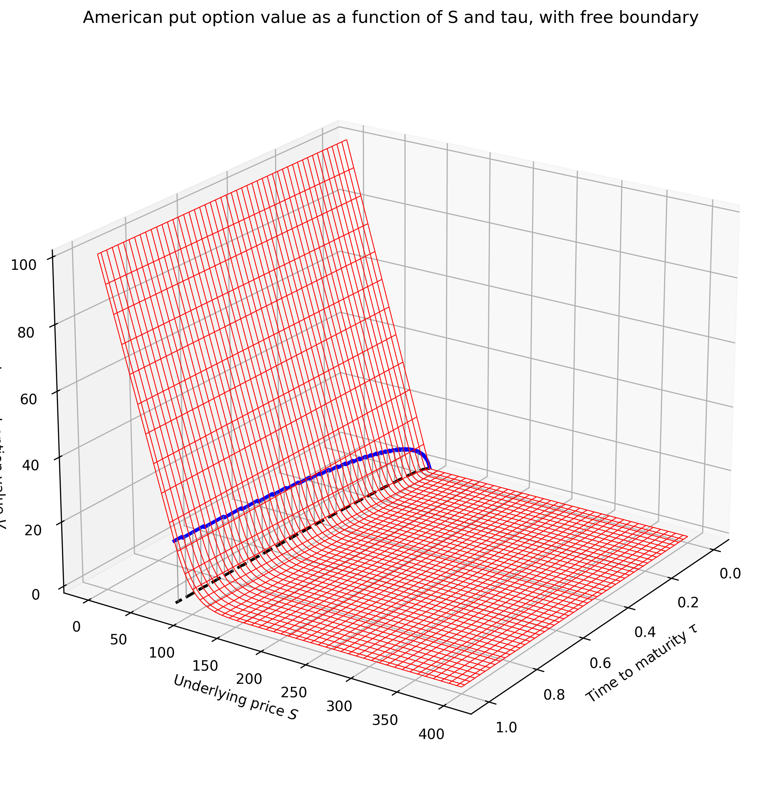

The following surface plot of the excess of the American option price over the European price also demonstrates how their prices converge as the time to maturity tends to zero:

  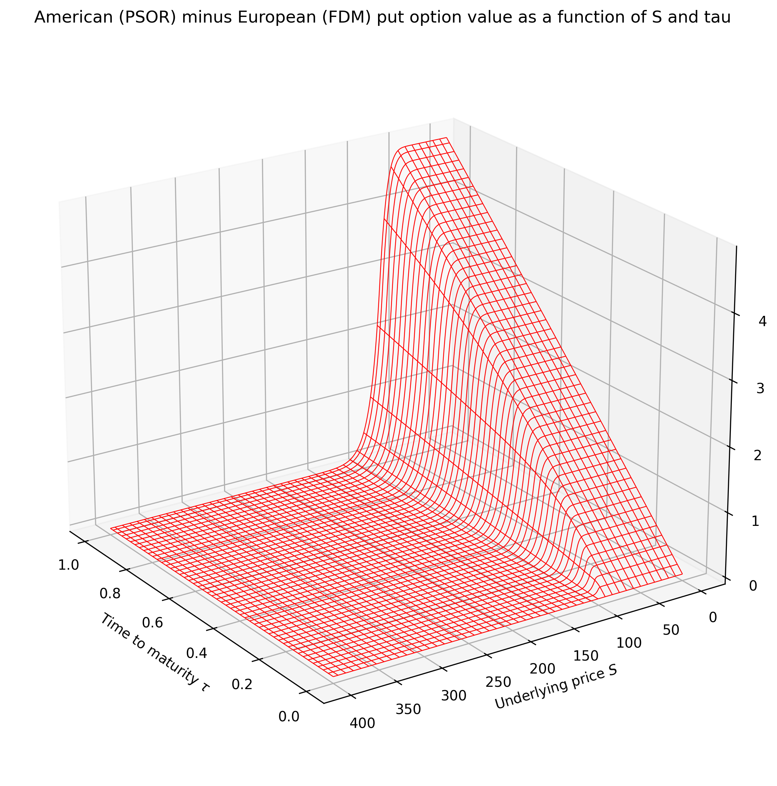

We now move on to study the regularity of our numerical solution across the free boundary away from maturity. Recall that we expect $\Delta = \frac{\partial V}{\partial S}$ to be continuous (in fact Lipschitz with Lipschitz norm -1) across the free boundary by the smooth-fit condition, but $\Gamma = \frac{\partial^2 V}{\partial S^2}$ is expected to admit a jump from zero in the exercise region to positive values in the continutation region. We begin with a plot of Delta at $t=0$ for both the European and American put options, demonstrating a genuine qualitative difference between the solutions that may not have been evident from the plots above: 

  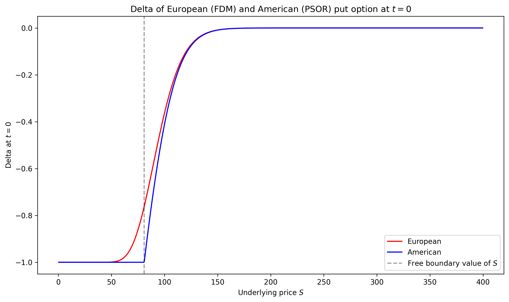

As predicted, the curve appears smooth in the European case but only Lipschitz in the American case, with a jump in the derivative at the free boundary threshold value. We also plot Delta in the American case over the whole time period, including the projection of the free boundary (we omit the European plot for neatness):

  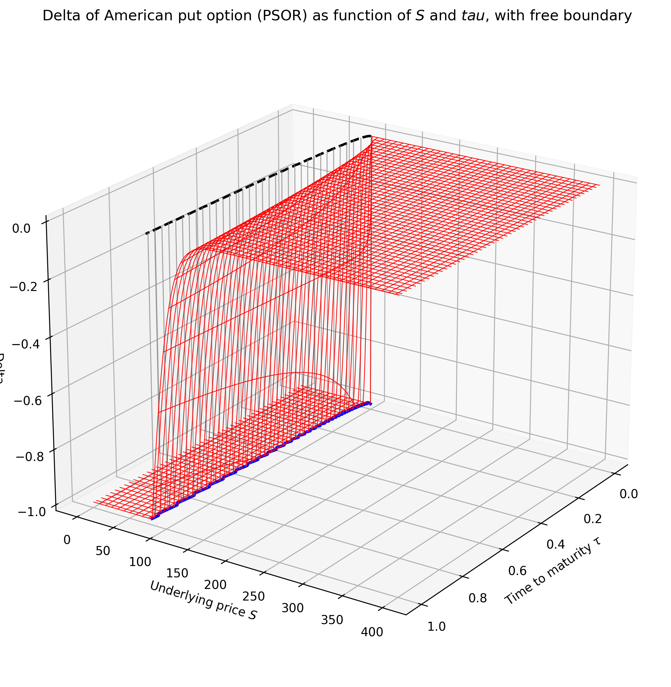

The discontinuity of Gamma (i.e. the non-differentiability of Delta) in the American case should present itself numerically as a near-vertical jump at the free boundary. We begin with a plot of Gamma at $t=0$ for both the European and American put options, which demonstrates this jump clearly:

  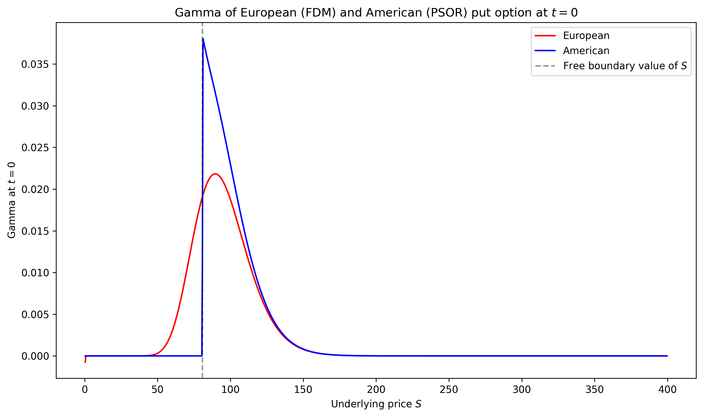

Due to certain numerical instabilities arising in the computation of second derivatives, we omit the projection of the free boundary onto the Gamma surface plot, but visually it should be obvious where this occurs:

  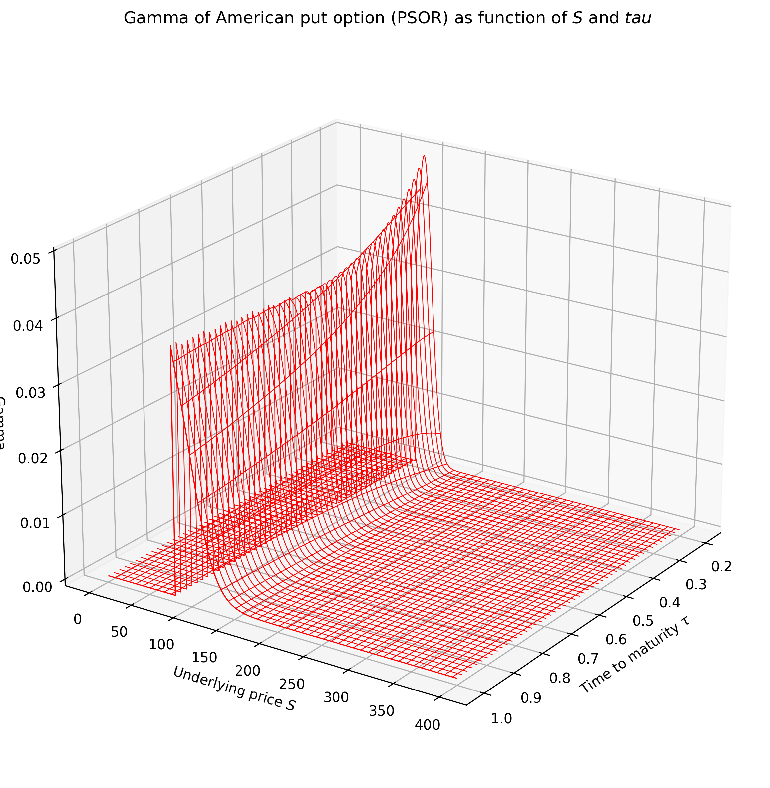

## References

[1] G. Barles, J. Burdeau, M. Romano, N. Samsoen, *Critical stock price near expiration*, **Mathematical Finance, Vol. 5 No. 2: 77-95, 1995.**

[2] P. Jaillet, D. Lamberton, B. Lapeyre, *Variational Inequalities and the Pricing of American Options*, **Acta Applicandae Mathematicae 21: 263-289, 1990.**

[3] P. Wilmott, S. Howison, J. Dewynne, *The Mathematics of Financial Derivatives*, **Cambridge University Press, 2009.**
